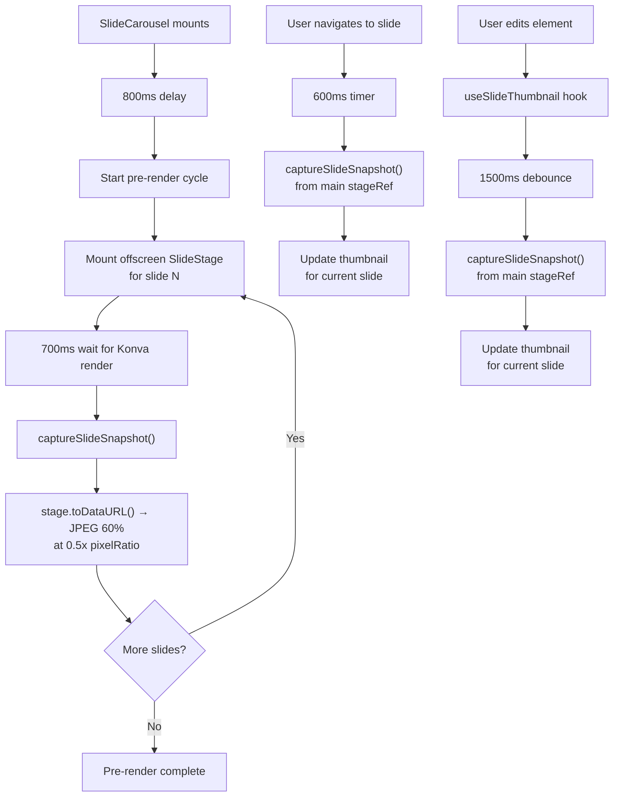
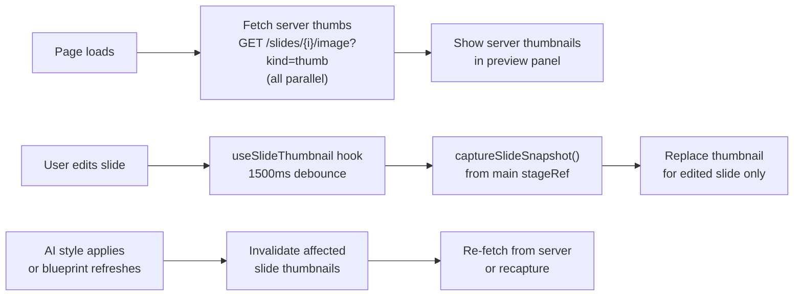

# Thumbnail Pre-Rendering System — Deep Analysis

## Current Architecture

The thumbnail system lives entirely inside `SlideCarousel` (defined in [GeneratedDeckView.tsx:876-1211](file:///home/siddarth/general/pptGen/slidegen-frontend/src/pages/GeneratedDeckView.tsx#L876-L1211)) and uses three separate capture mechanisms:



### Three Capture Paths

| Path | Trigger | Delay | Purpose |
|---|---|---|---|
| **Pre-render loop** | Component mount | 800ms init + 700ms/slide | Populate all thumbnails on load |
| **Navigation capture** | `idx` changes | 600ms | Update stale thumbnail after viewing slide |
| **Edit capture** | `contentHash` changes | 1500ms debounce | Update thumbnail after content edits |

### How the Pre-Render Loop Works

1. On mount, after 800ms delay, it starts at the current slide index
2. For each slide: mounts a **full `<SlideStage>`** component off-screen at `left: -9999px`
3. Waits 700ms for Konva to render all shapes/text/images
4. Calls `captureSlideSnapshot()` → `stage.toDataURL({ mimeType: 'image/jpeg', quality: 0.6, pixelRatio: 0.5 })`
5. Stores the base64 data URL in a `Map<slideId, string>` via React state
6. Advances to next unrendered slide via `findNextPreRenderIdx()`
7. Sets `preRenderIdx` state, which triggers a new offscreen `<SlideStage>` mount

### Cost Per Slide

Each pre-render cycle involves:

| Step | Cost | Notes |
|---|---|---|
| React reconciliation | ~5-20ms | Full SlideStage component tree mount |
| Konva Stage instantiation | ~10-30ms | Creates canvas context, layer, node tree |
| Element rendering | ~20-100ms | Depends on element count & types (images are expensive) |
| `stage.toDataURL()` | ~30-80ms | Canvas → JPEG encoding, scales with canvas size |
| React unmount + cleanup | ~5-15ms | Tear down previous SlideStage before next mount |
| **Timer wait** | **700ms** | Fixed wait regardless of actual render time |
| **Total per slide** | **~770-950ms** | Dominated by the timer |

### Total Time for N Slides

| Slides | Init Delay | Pre-render | **Total Budget** |
|---|---|---|---|
| 5 | 800ms | ~3.5s | **~4.3s** |
| 10 | 800ms | ~7s | **~7.8s** |
| 20 | 800ms | ~14s | **~14.8s** |
| 30 | 800ms | ~21s | **~21.8s** |

During this entire window, the main thread has a `setTimeout` firing every 700ms, triggering React state updates (`setPreRenderIdx`), which cause:
- Re-render of `SlideCarousel` 
- Mount/unmount of the offscreen `<SlideStage>`
- Re-render of `SlidePreviewPanel` (thumbnails Map updates)

---

## Key Problems

### 1. Full Component Mount/Unmount Per Slide
Each pre-render cycle creates a brand new `<SlideStage>` React component tree. This means:
- All hooks run (useState, useEffect, useLayoutEffect, useMemo)
- All refs are initialized
- Snapping system, selection system, editor system — all instantiated even though none are needed
- The entire 2,838-line SlideStage component executes for a read-only capture

### 2. 700ms Fixed Timer is Too Conservative
The timer waits 700ms regardless of whether Konva has actually finished rendering. For simple text+shape slides, rendering completes in <100ms. For slides with external images that need HTTP fetch, 700ms may not be enough.

### 3. Serial Processing
Slides are processed one at a time. No parallelism is exploited, even though the browser could theoretically run multiple offscreen canvases.

### 4. No Server-Side Fallback
Your backend already has a thumbnail API:
```ts
// lib/api.ts:167-169
export function slideImageUrl(themeId: string, index0: number, kind: 'snap' | 'thumb' = 'snap') {
  return `/api/admin/themes/${themeId}/slides/${index0}/image?kind=${kind}`
}
```
And the `new-slide-preview` endpoint returns `thumb_url` per slide. But the carousel doesn't use either — it always renders client-side.

### 5. Memory Pressure
Each base64 JPEG data URL for a 960×540 slide at 0.5x pixel ratio and 60% quality is roughly **15-40 KB**. For 30 slides, that's ~500 KB-1.2 MB of base64 strings held in React state.

---

## Optimization Strategies

### Option A: Server-Side Thumbnails (Initial Load) + Client-Side Updates (Edits)

**Concept:** Use the existing `slideImageUrl()` API to load initial thumbnails as `` URLs. Only switch to client-side `toDataURL()` capture after the user edits a slide.

```
Initial load: GET /api/admin/themes/{themeId}/slides/{i}/image?kind=thumb  (parallel, cached)
After edit:   captureSlideSnapshot(stageRef)  (from the main stage, debounced)
```

**Pros:**
- Zero client-side pre-render cost on load
- Server thumbnails are likely pre-generated and cached
- Parallel fetch via browser's native HTTP/2 connection pooling
- Images cached by browser's HTTP cache
- No offscreen SlideStage at all

**Cons:**
- Server thumbnails show the pre-edit state (stale after AI style edits refresh the blueprint)
- Requires a `?v=timestamp` cache-buster after edits + blueprint refresh
- Server may not generate thumbnails for newly created slides until a save

**Effort:** ~1-2 hours

---

### Option B: Single Persistent Offscreen Canvas (Reuse Konva Stage)

**Concept:** Instead of mounting/unmounting a full `<SlideStage>` per slide, keep a single hidden Konva `Stage` instance. Swap its elements programmatically (direct Konva API, no React reconciliation), render, capture, repeat.

```ts
// One-time setup
const offscreenStage = new Konva.Stage({ container: hiddenDiv, width: 960, height: 540 })
const layer = new Konva.Layer()
offscreenStage.add(layer)

// Per-slide capture
function captureSlide(elements: ElementBase[]): string {
  layer.destroyChildren()
  for (const el of elements) {
    // Add Konva shapes directly (no React)
    if (el.type === 'text') layer.add(new Konva.Text({ ... }))
    if (el.type === 'image') layer.add(new Konva.Image({ ... }))
    // etc.
  }
  layer.draw()
  return offscreenStage.toDataURL({ mimeType: 'image/jpeg', quality: 0.6, pixelRatio: 0.5 })
}
```

**Pros:**
- No React overhead — pure Konva imperative API
- Stage is reused — no mount/unmount
- No 700ms timer — capture immediately after `layer.draw()`
- Could process all slides in a tight loop (~50-200ms total vs ~14s)

**Cons:**
- Must duplicate the element rendering logic from SlideStage in imperative Konva (text, image, shape, table, smartart)
- Image elements require async loading (`Konva.Image.fromURL()`) — can't be synchronous
- Maintenance burden: two rendering paths that must stay in sync
- Table rendering (with cell borders, striping, headers) would be complex to replicate

**Effort:** ~4-6 hours (high complexity, especially tables + smartart)

---

### Option C: Hybrid — Server Thumbnails + Client Edit Capture (Recommended)

**Concept:** Combine Option A's server thumbnails for initial load with the existing `useSlideThumbnail` hook for edit-time updates. Remove the offscreen pre-render loop entirely.



**Implementation:**

1. **Remove** the offscreen pre-render system (lines 913-958, 1188-1208): `preRenderIdx`, `offscreenStageRef`, `preRenderDoneRef`, `findNextPreRenderIdx`, and the offscreen `<SlideStage>` mount

2. **Initialize thumbnails** as server URLs instead of data URLs:
   ```tsx
   const [thumbnails, setThumbnails] = useState<Map<string, string>>(() => {
     const map = new Map()
     slides.forEach((s, i) => {
       map.set(s.id, slideImageUrl(themeId, i, 'thumb'))
     })
     return map
   })
   ```

3. **Keep** the existing `useSlideThumbnail` hook for edit-time captures (already works well)

4. **Keep** the navigation capture (line 996-1018) for updating thumbnails after viewing a slide

5. **SlidePreviewThumbnail** component already handles both `` and the placeholder fallback — no change needed. Server URLs work as `src` just like data URLs.

**Pros:**
- Eliminates 100% of the pre-render cost
- No offscreen `<SlideStage>` mount — saves ~14s of main-thread work for 20 slides
- Server thumbnails are immediate (cached) and accurate
- Edit-time capture still works via existing hook
- Simplest implementation — mostly deletion of code

**Cons:**
- Server must have thumbnails available (they exist from the initial theme generation)
- After AI style edits, server thumbnails may be stale until re-fetched
- Need to thread `themeId` into `SlideCarousel` (currently not a prop)

**Effort:** ~1 hour

---

## Recommendation

> [!TIP]
> **Go with Option C (Hybrid)**. It's the least code, removes the most complexity, and leverages your existing infrastructure. The server already generates slide snapshots — there's no reason to re-render them client-side.

### What to do about stale thumbnails after AI edits

After a blueprint refresh (e.g., AI style apply calls `qc.invalidateQueries`), add a version cache-buster:
```tsx
// After blueprint refresh
setThumbnails(prev => {
  const next = new Map(prev)
  // Add timestamp to force browser re-fetch
  affectedSlides.forEach(slideId => {
    const slideIdx = slides.findIndex(s => s.id === slideId)
    if (slideIdx >= 0) {
      next.set(slideId, `${slideImageUrl(themeId, slideIdx, 'thumb')}&v=${Date.now()}`)
    }
  })
  return next
})
```

Or keep the existing `useSlideThumbnail` hook — it will re-capture from the main stage after the edit settles (1500ms debounce), effectively replacing the stale server thumbnail with a fresh client capture.

---

## Open Questions

> [!IMPORTANT]
> 1. **Does your backend always generate thumbnails for derived themes?** The `slideImageUrl()` helper exists, but I can't verify the server actually renders them for newly cloned themes. If it doesn't, Option C needs a fallback to the current placeholder approach.
> 2. **Are you open to threading `themeId` into `SlideCarousel`?** Currently it isn't passed as a prop. We'd need it to construct the server thumbnail URLs.
